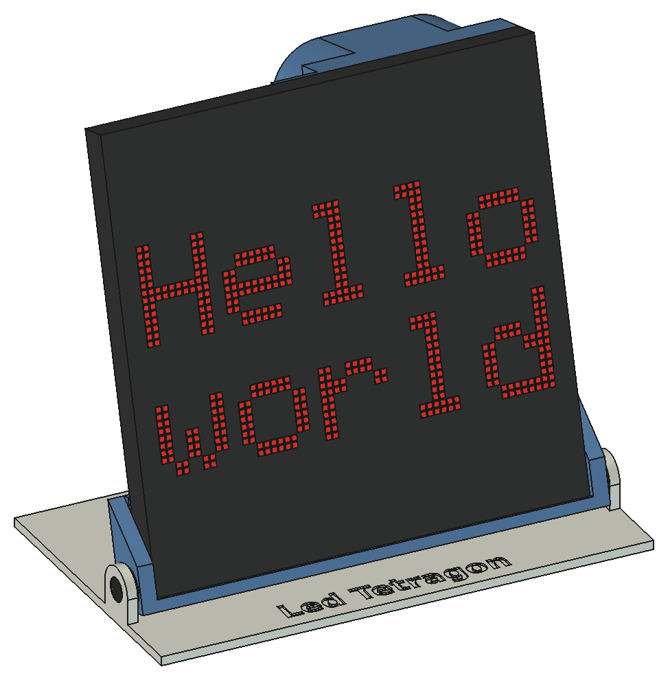
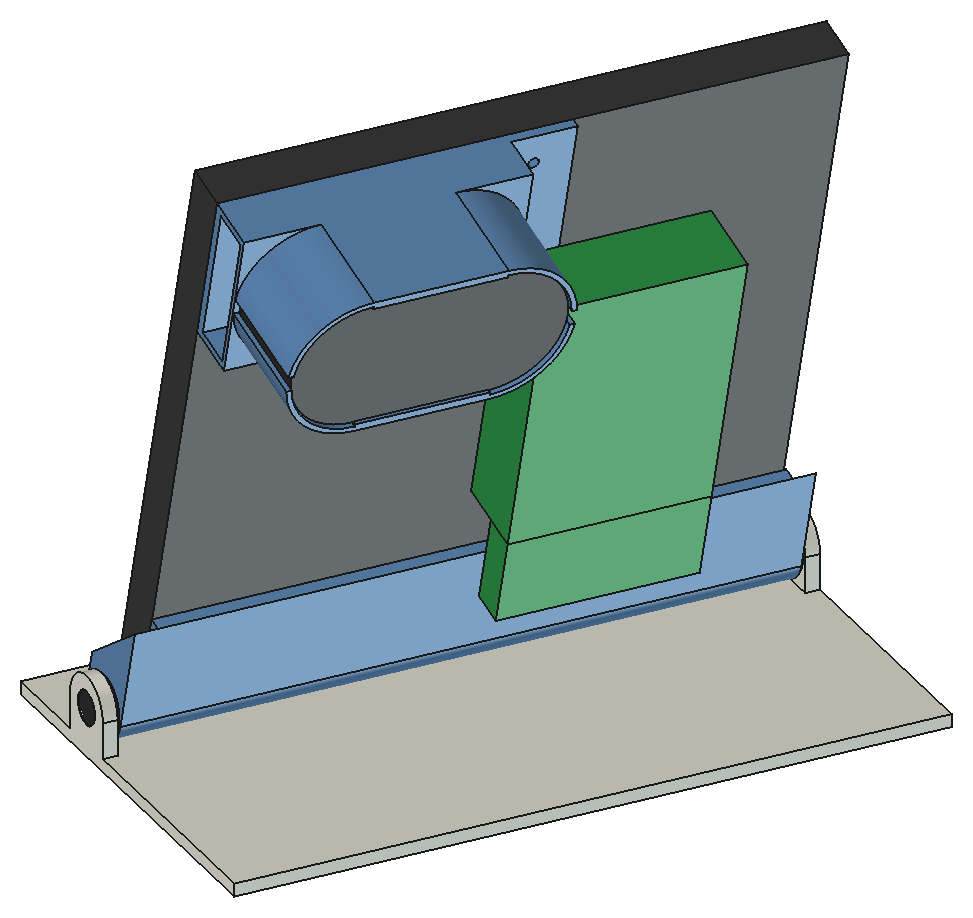

# led-tetragon-stand

A 3D-printed stand for the LED tetragon: one 64 x 64 P3 LED panel on its
factory frame, with the Raspberry Pi on the back. The panel leans back at an
angle that is set by hand (75 degrees to the table by default) and held by a
friction hinge with two countersunk screws. A holder on the back of the panel
carries the USB speaker and the micro:bit.

Print 1 x `base.stl`, 1 x `cradle.stl` (lying on its floor) and 1 x
`holder.stl` (standing on the rim of its cup). Also needed: 2 x M5 x 12
countersunk screw, 2 x M5 nut and 1 x M3 x 10 screw.

The model is made in FreeCAD 1.x from `build_stand.py`; all dimensions are in
the `Params` spreadsheet in `stand.FCStd`. Run `./build.sh` to build, check
and save the files. See [PLAN.md](PLAN.md) for the design and the measurements.

## Licence

GNU General Public License v3.0, see [LICENSE](LICENSE).
